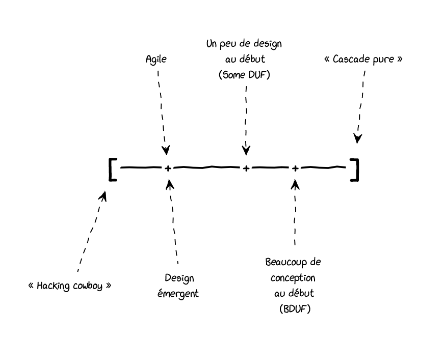
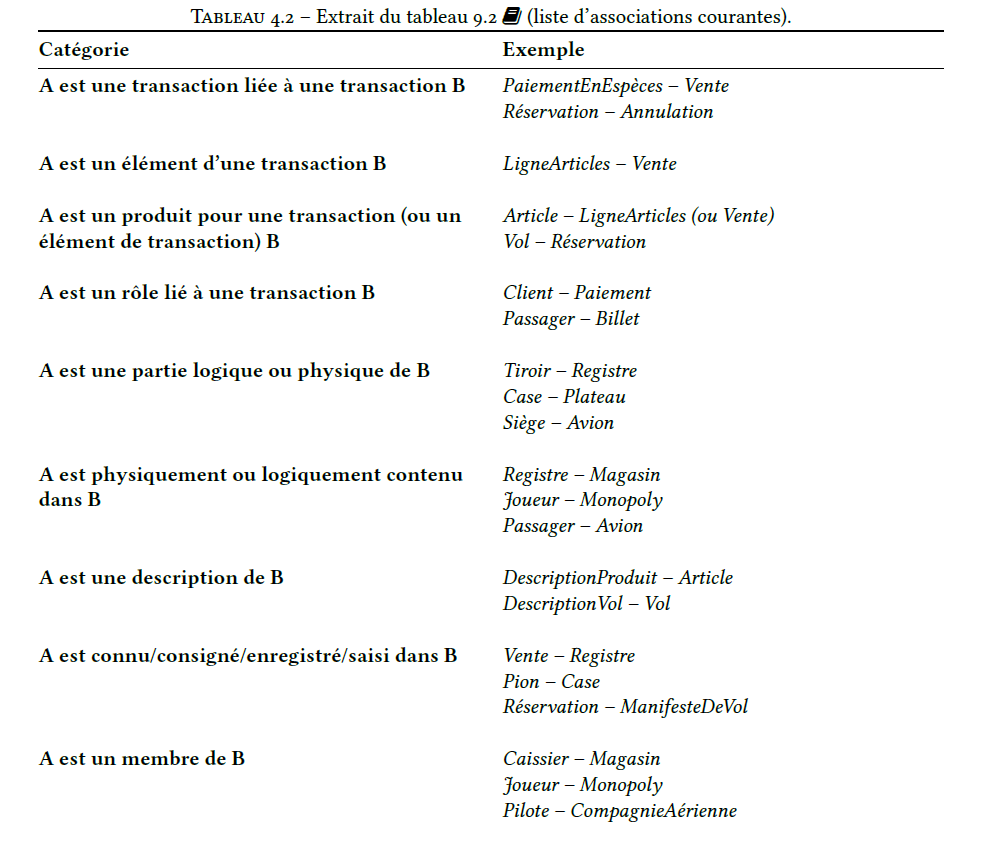
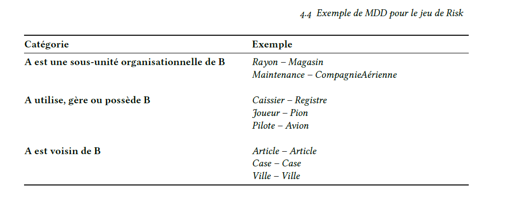
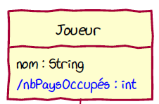

# Cours 3

# Cours

## Contrats

**Definition:** document décrivant ce qui est arrivé apres l'exécution d'une opération système
Contient :

- signature de l'opération système : saisrArticle(codeArticle: CodeArticle, quantite : int)

- postconditions
  - création ou suppression d'instances
  - modification des valeurs des attributs
  - formation ou rupture des associations

Les contrats :

- facilite la conception OO (RDCU)
  - todo list
  - RDCU s'inspire du MDD (réduire décalage des représentations)
- donnes des conditions pour les tests
- aide à valider le MDD

## GRASP créateur

qui crée (postcondition d'un contrat)
solution :

- affecter à la clase B, la responsabilité de crer les objets d'une classe A **Si**
  - b possède les données d'initialisation des objets A
  - b contient ou agrège des objets A
  - b utilise étroitement des objets A
  - b enregistre des objets A
- S'inspirer du MDD

## GRASP EXPERT

problème : quel est le principe général d'Affectation des responsabilités aux objets
Solution : Affecter la responsabilité à la classe qui possède les informations nécessaires pour s'en acquitter

# Notes de cours

## Principes GRASP

- Approche qui mène vers la modularité et la maintenabilité
- "Principe pour déterminer où mettre une **Méthode**

### Spectre de la conception

#### Effort pour la conception :

- une extrémité : Hacking cowboy
  - faire du code qui marche
  - difficile à maintenir
- l'autre extrémité : cascade pur
  - beaucoup d'efforts sur la conception
  - non idéal

**Négligence à la conception = Dette technique**

## Attributs manuel : section 9.16

**On fait figurer les attributs quand les cas d'utilsation suggèrent la nécessité de mémoriser des informations**

#### Synthaxe => visibilité nom : type multiplicité = défaut {propriété}

- Le type d'un attribut est important et il **faut les spécifier and un MDD**
- On ne se soucie pas de la visibilité des attributs dans un MDD
- Faire attention à l' attribut devant être une classe
- Certaines informations mieux modélisées par des associations

## Associations manuel : section 9.14

**Définition:** relation entre des calsses (ou des instances de classes)

- Indique une connexion signigicative ou intéressante
- Facile de trouver beaucoup d'associations --> besoin de se limiter
- On se limite aux associations qui doivent être conservées un certain temps
  - pensez à la mémorabilité d'une association dans le contexte du logiciel à développer
- Des associations peuvent dériver de la liste des associations courantes
- En UML, les associations son représenteés par des lignes entre les classes
  - nommées (**Verbe commencant avec une majuscule**)
  - noms simples (a , utilise, possède, contient) sont des choix médiocres
  - une flèche de sens de lecture optionnelle indique la direction dans laquelle lire l'association
  - extrémités des associations ont une expression de la multiplicité indiquand une relation numérique entre les instances

## Attributs dérivés manuel : section 9.16

- Attributs qui sont calculés à partir d'autres informations reliés à la classe.
- Indiqués par le symbole "/" devant leur nom

## Diagramme de séquence système (DSS) manuel : section 10

diagramme UML limité à un acteur et le système.

- Toujours un titre
- acteur est indique dans la notation par un bonhomme
- acteur est représente comme une instance de la classe du bonhomme
  - comme _:Joueur_
- le système est un objet, n'est jamais détaillé plus
- but du dss est de définir des opérations systèmes
- conception de haut niveau
- le coté acteur est une couche de présentation (interface graphique)
- **les opérations système ont des arguments de type primitif**
- types d'arguments sont importants --> **Spécifier dans les opérations sytème du DSS**
- message de retour vers l'acteur représente la communication des information prrécises

## DSS = Abstraction de la couche présentation

- but du dss est de concentrer sur l'API de la solution
- conception de haut niveau
- système est une boite noire

## Réalisations de cas d'utilisation (RDCU) manuel : section 18

- synthèse des informations spécifiées dans le MDD, le DSS et les contrats d'opératioons
- sert à esquisser une solution

**Tout RDCU fait les choses suivantes**

- spécifier un contrôleur (pour la première opération système dans un dss, qui sera le même pour le reste des opérations dans le DSS)
- satisfaire les postconditions du contrat d'opération correspondant
- rechercher les informations qui sont éventuellement rendues à l'actuer dans le DSS

--

#### RDCU :

- c'est un diagramme de séquence en UML
  - pas nécessaire de faire les boites d'Activation
  - on se sert des annotations pour documenter les choix (GRASP)
  - on dessine à la main des diagrammes
  - pour le retour, on affecte le retour au message (i.e. : _c = getClient()_)
- plus agile que coder

## Spécifier le controleur

On spécifie le controleur selon GRASP

## Statisfaire les postconditions

- dans le RDCU, on doit respecter le GRASP créateur
- plusieurs manière de former une association entre 2 objets
  - si aggrégation : c'Est probablement une méthode (add())
  - si association simple, considérer la navigabilité de l'association, (est ce qu'il faut pouvoir retrouver l'objet a à partir de l'objet b ou vice-vesa ==> a.set(b))
  - si formation d'association entre un objet et un autre, sur unebase de correspondance avec unidentifiant passé comme argument, il faut repérer le bon objet d'abord
- pour modifier un attribut, il suffit de suivre le principe GRASP EXPERT

## Visibilité

si un message est envoyé à un objet, ce dernbier doit être visble à l'objet qui lui envoie le message.

- pour un objet racine, il peut s'agir d'un objet singleton

ou

- l'objet émetteur a une référence de l'objet récepteur
  - stocké comme attribut
  - passée comme argument dans un message antérieur
  - affectée dans une bariable locale de la méthode

# Manuel

## 9.16

## 9.12

Common mistake when creating a MDD, represent something as an attribute when it should have been a conceptual class

- Guideline : if we do not thinkm of some conceptual class X as a number or text in the real world, X is probably a conceptual class, not an attribute

## 9.14

# Quiz

## Takeaways

- poiunt de départ pour un RDCU est l'opération système provenant du DSS pour le CU
- le CU doit exister avant de pourvoir faire un DSS
- les deux point ":" dans une boite d'objet ou classe est une instanciation anonyme
- classe d'association permet d'associer des attributs à une association
- attribut dérivé est calculé à partir des associations
- association multiple nécessite l'utilisation des roles pour clarifier la responsabilité de l'association
- justifié une association entre deux classes conceptuelles
  - besoin de conserver la mémoire de leur relation
  - il s'agit d'une association dérivé de la liste des associations courantes
  - pas dans ce cas : une association dans la vrai vie
- On ajoute une classe description lorsque la suppression d'intance d'une entité quelle décrit entraine la perte d'uineinformaiton qui doit être mémorisé
- On ajoute une classe description pour réduire la redondance ou la duplication des informations
- On ajoute une classe description lorsqu'il est nécessaire de disposer de la description d'un produit ou d'un service, peu importe l'existence des produits | services
- triangle dans une association indique le sens de la lecture du nom de l'Association
- on passe une entité en termes alphanumérique dans le monde réel, --> il s'agit d'un attribut d'une classe conceptielle
- Dans le MDD, pas de méthodes
- RDCU : esquisse d'une solution logicielle avec messages et objets pour la visualisation | évaluation de la conception sur le plan de la modularité
- Opération système : verbeNom
- Opération système est le point de départ pour un RDCU
- Message de retour sur une opération système est facuilatif
