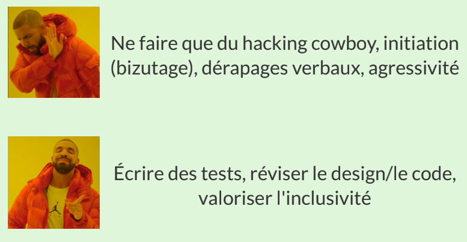

# Cours 5

## Culture d'équipe

Ensemble de valeurs, d'objectifs, d'expériences

- Unique à chaque équipe

### éléments techniques :

- revues de code
- TDD
- Documentation de la conception
- ETC

### éléments sociaux

- sushi à midi
- 5 a 7 le vendredi
- etc

### Culture forte d'équipe

- Ouverte au changement qui l'améliore
- Résistante à un changement radical qui lui fait mal
- Celle qui concentere l'effort sur la livraison de logiciel génial est celle qui réussit la mieux
- Efforts pour souder une équipe ne mène pas toujours à la productivité
  - faire la fête, surenchère de programmation, faire des rencontres

## Vrai problème du couplage

### COUPLAGE FORT VERS LES CHOSES INSTABLES :

- une classe dont l'API risque de changer
- les classes de la couche de présentations (vues, le patron observateur résout ce problème)
- un module externe hors de notre contrôle (nnpm est un bel exemple)

## Contrats :

- Contrats pour chaque opération système
- regarder toujours le MDD
- **Rappeler le sformes de postcondition**
  - Creer supprimer instance
  - former briser association
  - modifier attributs
- Ne rien oublier (marquer le MDD, faire un diagramme d'objets)

## Révisions GRASP

### CONTROLEUR

- Controleur de facade qui correspond à une classe du MDD et rpésente le
  1. système global
  1. un objet racine
  1. un équipement
  1. un sous-système
- Controleur de session

### Créateur

Qui crée?
On affecter à la classe B la responsabilité de créerles objets d'une classe A si :

- B Possède les do nnées d'initialisation des objets A
- B Utilise étroitemetndes objets A
- B Contient ou Agèrge des objets A
- B Enregistre des objets A

**Acronyme puce**

### Expert

Quel est le principe général d'affectation des responsabilités aux objets ?
On affecte une responsabilité à la classe qui possède les informations nécessaires pour s'en acquitter

### Faible couplage

Comment réduire l'impact des modifications :

- Assigner les responsabilités de sorte à **éviter tout couplage inutile**
- Applique ce principe pour **évaluer plusieurs solutions possible**

### Forte Cohésion

Comment s'assurer que les objets restent compréhensibles et faciles à gérer, et, bénéfice second, qu'ils contribuent au Faible Couplage :

- Assigner les responsabilités de sorte que la cohésion demeur élevée.
- Appliquer ce principe pour évaluer les solutions possibles

# Notes de cours

## Développement de logiciel en équipe

Raisons pour lesquelles on cache le code source :

- Code n'Est pas fini
- Peur du jugement
- Peur de vole d'idées

Ces comportements augmentent les risques suivants :

- faire des erreurs dans la conception initiale
- réinventer la roue
- terminer le travail plus tard que son compétiteur, qui, lui à collaboré avec son équipe

### Humilité , Respect, Confiance

- Qualitées de base pour le bon travail en équipe
- Pratiquement tout conflit social est du à un manque d'humilité de respect ou de confiance

#### Humilité

**Définition:** Disposition à s'abaisser volontairement, par sentiment de sa propre faiblesse

Voici comment une personne humble pense :

- Je ne suis pas le centre de l'univers
- Je ne suis ni omniscient, ni infaillible
- Je suis ouver à m'améliorer

#### Respect

Une personne démontrant du respect pense ainsi :

- Je me soucie des gens avec qui je travaille
- Je les traites comme des être humains
- J'ai de l'estime pour leurs capacités et leurs réalisations

#### Confiance

Une personne démontrant la confiance pense ainsi:

- Je crois que les autres coéquipiers sont compértents et qu'ils feront labonne chose
- Je suis à l'aise lorsqu'ils prennent le volant, le cas échéant

### Redondance des compétences dans l'équipe (Bus factor)

Pour une équipe robuste, il faut des redondance des compétences
Sinon, la perte d'un coéquipier peut engendre de graves conséquences.
Bus factor = nombre minimum de coéquipiers à perdre pour arrêter le projet par manque de personnel bien informé ou compétent.

#### Conseils pour le mentorat:

- avoir les compétences sur un plan technique
- ertre capable d'expliquer des choses à quelqu'un d'autre
- savoir combien d'aide à donner à la ppersonne encadrée

## Développement piloté par les tests

Pratique populaire ou on écrit des logiciels avec un composant d'autobalidation.

- TDD propose de travailler en petits pas
- test simple puis écrire la partie du logiciel pour passer le test de manière simple (le plus simple)
- Tests pour les fonctionnalités
- Développement en petits incréments qui sont balidés par les tests

### Kata TDD

but est de développer la fluidité avec le développement piloté par les tests.

# Manuel

## A17.12 GRASP Faible Couplage

### Problem

How to suppport low dependency, low change impact and increased reuse ?

Coupling is a measure of how strongly one element is connected to, has knowledge of, or relies on other elements
An elemnent with low coupling is not dependent on too many other elements.
Elements includes : classes, subsystems, systems, and so on

high coupling is not desirable because :

- Froced local changes because of changes in related classes
- Harder to understand in isolation
- Harder to reuse bevause its use requires the additional presence of the classes on which it is dependent

### Solution

Assign a responsibility so that coupling remains low. Use this principle to evaluate alternatives

### Discussion

A principle to keep in miond during all design decisions. It is an underlying goal to continually conseder. It is an **evaluative principle** that you apply while evaluating all decisions

Low coupling encourages you to assign a responsibility so that its placement does not increase the coupling to a level that leads to the negative results produced by high coupling

It supports the design of classes that are more independent. Reduceing the impact of change.

A subclass is strongly coupled to its superclass.

### Contraindications

High coupling to stable elements and to pervasive elements is seldom a problem

#### High coupling to elements that are unstable is bad

### Benefits

- not affected by changes in other components
- simple to understand in isolation
- convenient to reuse

## A17.14 GRASP Forte Cohésion

### Problem

How to keep objects focused, understandable , and manageable, and as a side effect, support low coupling?

Cohesion is a measure of how strongly related and focused the responsibilities of an element are.
An element with highly related responsibilities that does not do a tremendous amount of work has high cohesion
These elements include classes, subsystems, and so on.

### Solution

Assign a responsibility so that cohesion remains high. Use this to evaluate alternatives

A class with low cohesion **does many unrelated things** or **does too much** work.
Such classes are undesirable; they suffer fromt the following problems :

- Hard to comprehend
- Hard to reuse
- Hard to maintain
- delicate; constantly affected by change

Low cohesion classes often represent a very "large grain" of abstraction or have takon responsibilities that should have been delegated to other objects

**In practicve, the level of cohesion alone can't be considered in isolation from other responsibilities and other principles such as Expert and Low Coupling**

### Discussion

high cohesion is a principle to keep in mind during all design decisions.
Underlying goal to continually consider.
Evaluative principle that a designer applis while evaluating all design decisions

As a rule of thumb, a class with high cohesion has a relatively small number of methods. with highly related functionality, and does not do too much work. It collaborates with other objects to share the effort if the task is large.

High cohesion is advangtageous because it is re latively easy to maintain, understand and reuse.  
High degree of related functionality , combined with a small number of operations simplifies maintenance.

### Contraindications

lower cohesion is j ustified in some case
grouping of responsibilities or code into one class or componenet to simplify maintenance by one person.
Distributed server objects.

### Benefits

- clarity and ease of comprehension
- maintenance and enhancements
- Low coupling is often supported
- Reuse of fine-graind highly related functionality is increased because a cohesive class can be used for a very specific purpose

# Quiz

## Takeaways

- Bus factor est le degré de redondance des compétences dans une équipe
- Si une personne nous dis qu'elle a recu assez d'aide, ce n'est pas indicateur que c'est vrai
- Il faut aider cest coéquipiers
- Principe GRASP pour minimiser les dépendances dans la conception = faible couplage
- Pour decider d'une attribution de création (Créateur) on peut s'aider des principes Forte cohésion et Faible couplage
- Parties essentielles du TDD :
  - Faires des petits pas
  - Corriger les bogues dans les tests
  - Faire du réusinage
  - Écrire un test qui passe
  - Écrire un test qui échoue
- Parties facultatives du TDD :
  - Utiliser un framework automatique de tests
  - Faire des katas
  - Travailler à deux
  - Utiliser un environnement de développement avec les fonctionnalités automatisant des réusinages
- Importance du bus factor : eviter qu'une équipe soit incapable d'avancer si des membres quittent l'équipe
-
