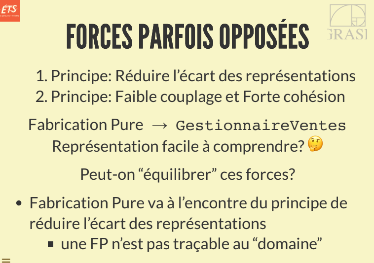
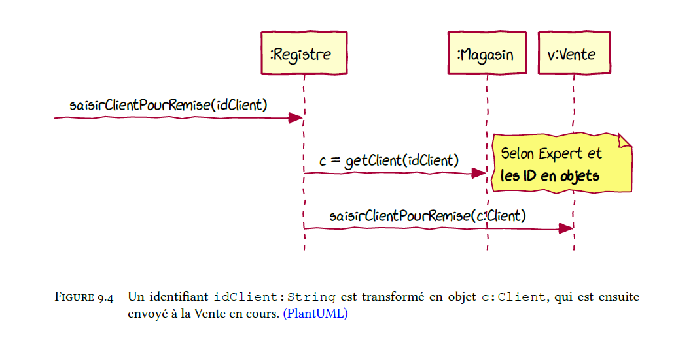

# Cours 6

# Notes de cours

Forces de Fabrication pure :

## Transformer identifiants en objets

Utiliser les types primitifs pour les opérations système = problème dans les RDCU

- Transformer un identifiant (souvent de type String ou int) en objet.

Solution : idiome Transformer identifiant en objet.

## Patron faire soi même manuel : Section A33.7

**Réduit le décalage des représentations**

**Faire soi-même:** Moi, l'objet logiciel, je fais moi-même ce qu'on fait normalement à l'objet réel dont je suis une abstraction

# Manuel

## Polymorphism A25.1

### Problem

hpw handle alternatives based on type? How to create pluggable software components

- Alternatives based on type : conditional variation, if theres a new condition arising : new if-then-else, new case statement, software will require modification
- Pluggable software components : viewing com ponents in client-server relationships, how can you replace one server component with another., without affecting the client

### Solution

When related alternatives/behaviors vary by type (class), assign responsibility for the behavior - using polymorphic operations- to the types fow which the behavior varies.

### Discussion

fundamental principle in designing how a system is organized to handle similar variations. A design based on assigning responsibilities by Polumorphism can be easily extended to handle new variations.

#### When to designe Interfaces :

introduce an interface when you want to support polymorphismwithout being committed to a particular class hierarchy. If an abstract superclass AC is used without an interface, any new polymorphic solution must be a subclass of AC = limiting in single-inheritance languages such as java and C#.

Rule of thumg : if there is a class hirearchy with an abstract superclass C1, consider making an interface I1 that corresponds to thepublic method signatures of C1, and then declare C1 to imploement the I1 interface.

### Contraindications

critical evaluation is required, because it is not uncommon to see unnecessary effort being applied to future-proofing a design with polymorphism at variation points that in fact are improbable and will never actually arise.

### Benefits :

- Extensions required for new variations are easy to add
- New implementations can be introduced without affecting clients

## Pure fabrication A25.2

### Problem

What object should have the responsibility, when you do not want to violate high cohesion and low coupling, or other goals, but solutions offered by Expert (for example) are not appropriate.

### Solution

Assign a highly cohesive set of responsibilities to an artifical or convenience class that does not represent a problem domain concept -- something made up, to support high cohesion, low coupling and reuse.

Such a class is a frabication of the imagination. Ideally, the responsibilities assigned to this fabrication support high cohesion and low coupling, so that design of the fabrication is very clean or pure.

Pure fabrication relates to the fabrication of the class, not to be confuse with factory.

### Discussion

The design of objects can be broadly divided into two groups :

1. those chosen by representational decomposition
1. Those chosen by behavioral decomposition

**Representational decomposition :** the software class is related to or represents a thing in a domain. It is a common strategy in object design and supports the goal of low representational gap.

**Behavioral decomposition :** assign responsibilities by grouping behaviors or by alforithm, without any concern for creating a class with a name or purpose that is related to a real-world domain concept. Convenience class conceived by the developer to group together some related behavior or methods.

### Benefits :

- High cohesion is supported because responsiblities are factored into a fine grained class that only focuses on a very specific set of related tasks
- Reuse potential may increase because of the presence of fine-grained Pure Fabrication classes whose responsibilities have applicability in other applications.

### Contraindications

Can sometimes be overused by those new to object design and more familiar with decomposing or organizing software in terms of function.
If overused, pure fabrication could lead to too many behavior objects that have responsibilities not co-located with the information required for their fulfillment, whcich can adversely affect coupling.

# Quiz

## Takeaways

- Une méthode qui est toujours implémentée de la même facon, bien qu'elle appelle à des méthodes polymorphes, n'est pas une méthode polymorphe
- Pour gérer les alternatives if-then-else, utiliser GRASP polymorphe
- Transformer ID en objets ne s'applique pas dans la couche présentation, celle-ci passe les identifiants des objets du domaine aux controleurs dans une opération système. Les arguments identifiant des objets sont transformés en objets par la couche domaine.
- Forces de conception du pattern **Transformer ID en objets**
  - On doit passer dans une opération système des identifiants uniques de type primitif pour respecter la séparation de la couche présentation et la couche domaine
  - Les opérations sytème ne peuvent pas avoir des arguments de type d'objet (du domaine)
  - **Élément qui ne fait pas partie des forces de conception du pattern :**
    - Passer des objets du domaine comme arguments dans une opération système consomme plus de mémoire et nui à la performance du système. Il est plus rapide de passer des identifiants de types primitifs et de les transformer plus tard en objets
- Transformer en ID va de pair avec le patron GRASP Expert, c'est ce patron qui nous aide à trouver la classe qui peut s'acquitter de cette transformation
- Polymorphisme permet de créer des composants logiciels "enfichables" ("pluggable")
