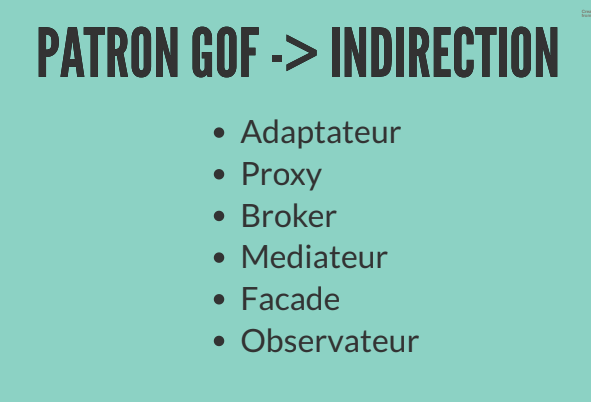

# Cours 7

# Notes de cours

## Indirection

On évite du couplage direct entre deux classes. On donne la responsabilité qui créer trop de couplage à un objet intermédiaire

## Protection des variations

On identifie les points de variations ou d'instabilité prévisibles et on attribut les responsabilités afin de créer une "interface" stable autour d'eux

## Patrons observateur

- Modèle avertit les vues lorsqu'il arrive un événement qui leur intéresse
- Un bouton avertit ses "abonnés" (listeners) lorsqu'il arrive quelque chose d'intéressant
- Les vues s'abonnent (s'attachent) au modèle afin d'être averties
- Des "Action listeners" s'abonnent à un bouton afin d'être avertis
- Généralisation : Des observateurs s'abonnent à un sujet

### Context

1. Un objet, nommé sujet, est une source d'événements
1. Un ou plusieurs obserrvateurs s'intéressent à ces événements et voudraient être avertis à l'arrivée d'un tel événement

### Solution

1. Définir un type interface observateur. Tout Observateur concret l'implémente
1. Le suje gère une collectiond'observateurs
1. Le sujet fournit des méthodes pour ajouter ou enlever des observateurs
1. Lorsqu'un événement arrive, le sujet avertit tous les observateurs dans la collection

# Manuel

## A25.3 GRASP Indirection

### Problem

Where to assign a responsibility to avoid direct coupling between two or more things? How to de-couple objects so that low coupling is supported and reuse potentials remains higher

### Solution

Assign the responsibility to an intermediate object to mediate between other components or services so that they are not directly coupled.
The intermediary creates an indeirection between the other components

### Discussion

**example :** We provide a consistent interface to the inner objects and hide the variations in the external APIs. By adding a level of indirection and adding polymorphism, the adapter objects protect the inner design against variations in the external interfaces.
Most problems in computer science can be solved by another level of inderection

Just as many existing design patterns are specializations of Pure Fabrication, many are also specializations of Indirection. Adaptater, Facade Observer are examples. Pure Fabrications are generated because of Indirection. The motivation for inderection is usually low coupling; an intermediary is added to decouple other components or services

### Benefits

- Lower coupling between components

## A25.4 GRASP Protection des variations

### Problem

How to design objects, subsystems, and systems so that the variations or instability in these elements does not have an undesirable impact on other elements?

### Solution

Identify points of predicted variation or instability; assign responsibilities to create a stable interface around them

### Discussion

data encapsulation, polymorphism, data-driven designs, interfaces, virtual machines configuration files, operating systems, and much more are a specialization of Protected Variations

It provides flexibility and protection from variations.

### Contraindications

- variation point : variations in the existing current system or requirements such as the multiple tax calculator interfaces that must be supported
- Evolution point : speculative points of variation that may arise in the future but which are not present in the existing requirements

If it is for speculative future-proofing or speculative "reuse" with very uncertain probvabilities, then restraint and critical thinking is called for

### benefits

- Extensions required for new variations are easy to add
- New implementations can be introduced without affecting clients
  -Coupling is lowered
- The impac or cost of changes can be lowered

### Open closed principle

is the quivalent of the protection variation pattern an information hiding pattenrt

Definition : Modules should be both open (for extension; adaptable) and closed (the module is closed to modification in ways that affect clients)

# Quiz

## Takeaways

- Le principe GRASP exploitant le concept de masquage de l'information est Protection des variations
  -Le principe GRASP permettant de maintenir un potentiel de réutilisation d'un ou de plusieurs objets en évitant le couplage direct entre eux est Indirection
- le patrong GOF adapter joue le role d'indirection
- Dans le pattern observateur, le principe grasp protection des variations est appliqué comme cela: Les classes sujets sont protégées des variations des classes observateurs concrets grâce à l'interface strable Observer.
- Selon le MVC, les classes du modèle sont plus tables que les classes de la vue parce que faire des vues correctement est difficile et leur code change souvent
- Pour l'application du patron observateur dans le contexte MVC, avec l'application de GRASP protection des variations : les classes du modèle sont protégées des variations des classes de la vue grâce à l,interface stable Observer
- Il n'y a pas de fort couplage avec les sujets car les sujets ont un accès restreint aux observateurs. Les sujets voient les ovservateurs à travers l'interface Observer
- Pour éviter le couplage direct des classes de la couche présentation aux classes de la couche domaine, l'élément Controleur de session (ou de cas d'utilisation) est un exemple de GRASP indirection
- Protection des varaiations permet de minimiser l'impact sur les classes clients, malgré la présence de classes instables
