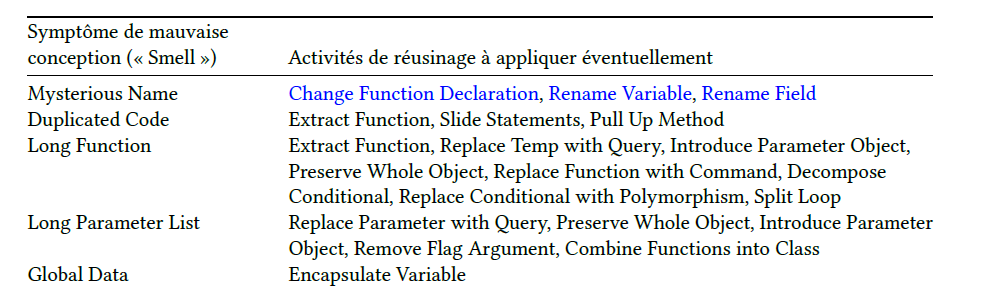
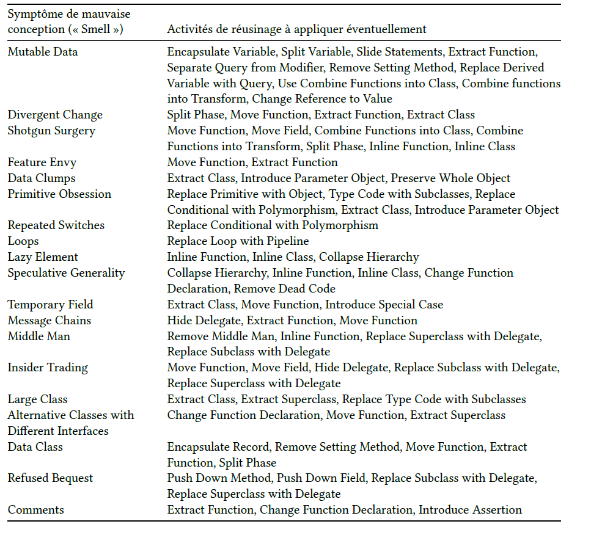

# Cours 8

## Résumer des couches

# Notes de cours

## Dette technique

Décision de la quantité de conception entraîne nécessairement une dette teachnique. C'est une métaphore pour aider à comprendre des conséquences à long terme pour des choix de conception permettant de livrer une fonctionnalité à court terme.
Elle peut apporter des bénéfices ou des pertes.

### Nuances de la dette technique

| Dette        | Imprudente                                                                                | Prudente                                                                                                                         |
| ------------ | ----------------------------------------------------------------------------------------- | -------------------------------------------------------------------------------------------------------------------------------- |
| Déliberée    | "On n'a pas le temps pour la conception!"   Cette forme de dette est rarement rentable | "Il faut livrer maintenant puis en assumer les conséquences."   Exemple: la dette est due à une partie limitée du code       |
| Involontaire | "C'est quoi la séparation en couches"   Il s'agit de l'ignorance de bo nnes pratiques | "Maintenant on sait comment on aurait dû le faire."   C'est tenter une solution malgré une compréhension limitée du problème |

## Réusinage

**Définition:** L'amélioration de la conception du code après avoir écrit celui-ci.
Il s'agit de retravailler le code source de façon à en améliorer la lisibilité ou la structure

### Symptomes de la mauvaise conception - Code smells

Repérage de mauvaise écriture de code avec solutions pour le réusinage

### Impropriété

restructuration n'est pas du réusinage, réusinage ne casse pas le code pendant plusieurs jours.
Le réusinage est basé sur les petites transformations qui ne changent pas le comportement du logiciel.

## Conception de packages manuel : section A35

Points importants:

- La notation UML des diagrammes de package
- Organiser les packages par cohésion
- Organiser les packages une famille d'interface
  - le package contient des interfaces
  - l'implementation est ailleur dans le code
- Créer un package par tâche et par groupe de classe instables (Branches)
  - package are the basic unit of development work and of release
  - hard to create package in early iterations
  - guideline : reduce widespread dependency on unstable packages
- Les packages les plus responsables sont les stables
  - How to increase stability
    - Contains only or mostly in terfaces and abstyract classes
    - it has no dependencies on other packages
    - It contains relatively stable code
    - It is mandated to have a slow change schedule
- Factoriser les types indépendants
  - Organize types that can be used independently or in different contexts into separate packages
- Utiliser **Fabrique** (factory) pour limiter la dépendance aux package concrets
- Comment rompre les cycles dans les packages
  - May need to be treated as opne larger pacjage in terms of a release unit if a group of packages have cyclic dependency

# Manuel

## A13.1 - 8 Architecture logique

Large-scale organization of the software classes into pacjages (or namespaces), subsystems, and layers.
A layer is a very coarse-grained grouping of classes , packages or subsystems that has cohesive responsibility for a major aspect of the system. Also, layers are organized such that higher layers call upon services of lower layers but not vice versa.

Typically, they include :

- User Interface
- Application Logic and Domain objects
  - Software objects reprensenting domain concepts (for example, a software class Sale) that fulfill application requirements, such as calculating a sale total
- Technical Services
  - General purpose objects and subsystems that provide supporting technical services, such as interfacing with a database or error logging. These services are usually application-independent and reusable across several systems

### What is software architechture

set of significant decisions about the organization of a software system, the selection of the structural elements and their interfaces by which the system is composed, together with their behavior as specified in the collaborations among those elements, the composition of these structural and behavioral elements into progressively larger subsystems, and architectural style that guides this organization

Has to do with the large scale - The big ideas in the motivations, constraints, organizarion, patterns, responsibilities, and connections of a system

### Guideline : Design with layers

- Organize the large scale logical structure of a system into discrete layers of distinct, related responsibilities, with a clean, cohesive seperation of concerns such that the lower layers are low-level and general services and the higher layers are more specific
- Collaboration and coupling is from higher to lower layers; lower-to-higher layer coupling is avoided

Helps with these problems :

- Source code changes are rippling throughout the system -- many parts of the systems are highly coupled
- Application logic is intertwined with the user interface, so it cannot be reused with a different interface or ditributed to another processing node
- Potentially general technical services or business logic is intertwined with more application-specific logic, so it cannot be reused, distributed to another node, or easily replaced with a diffreent implementation.
- There is high coupling across differenet areas of concern. It is thus difficult to divide the work along clear boundaries for different developers

### Typical layers

#### UI

- presentation view
- GUI windows
- reports
  -speech interface
- HTML, XML, XSLT, JSP, Javascript

#### Application

- Workflow, Process, Mediation, App controller
- Handles presentation layer requests
- workflow
- session state
- window/page transitions
- consolidation/transformation of disparate data for presentation

#### Domain

- business, application logic, model
- Handles application layer requests
- implementation of domain rules
- domain services (POS, inventory)
  - services may be used by just one application, but there is also the possibility of multi-application services

#### Business infrastructure

- Low level business services
- very general low-level business services used in many buisiness domains
- currencyConverter

#### Technical Services

- Technical infrastructure, high-level technical services
- relatively high-level technical services and frameworks
- Presistence, Security

#### Foundation

- Core services, base services, low level technical services infrastructure
- low level technical services, utilities, and frameworks
- data structures, threads, math, file, DB and network i/o

### Model-view principle

What kind of visibility should other packages have to the UI layer ? How shouyld non-window classes communicate with windows ?

**Principle :**

- Do not connect or couple non-UI objects directly to UI objects
- Do not put application logic in the UI object methods. UI objects should only initialize UI elements, receive UI events, and delegate requests for application logic on to non-UI objects

Domain objects should not have direct knowledge of the views

Motivations :

- to support cohesive model definitions that focus on the domain processes rather than on user interfaces
- To allow separate development of the model and user interface layers
- To minimize the impact of requirements changes in the interface upon the domain layer
- to allow new views to be easily connected to an existing domain layer, without affecting the domain layer
- To allow multiple simultaneous views on the same model object, such as both a tabular and business chart view of sales information
- To allow execution of the model layer independent of the user interface layer, such as in a message-processing or batch-mode system.
- To allow easy porting of the model layer to another user interface framework

# Quiz

## Takeaways

- Les couches les plus basses contiennent des fonctions réutilisables
- On retrouve les services de calculs dans la couche Fondation
- On retrouve les regles / requirements dans la couche domaine (logic de l'application)
- On retrouve les services de conversions de currency , ou d'autres services réutilisées ailleurs dans la couche business infrastructure | infrastructure métier
- La dette technique est une forme de risque
- La dette technique peut avoir des conséquences positives
  - production plus rapides de fonctionnalités
- Remplacers des codes d'une logique sur les types avec des sous-classes avec une implémentation différente pour chaque méthode est un exemple de polumorphisme
- L'extraction d'une fonction est un exemple d'Indirection
- L'Extraction des méthodes d'une classe pour former une nouvelle classe est un exemple de Fabrication pure
- L'introduction d'un objet paramètre n'est pas un patron GRASP
- Le déplacement d'une fonction est un exemple d'indirection
- Le changement de nom d'une variable n'est pas un patron GRASP
- Changer le nom d'une classe n'est pas un patron GRASP
- Buts du réusinages :
  - Rendre le code plus facile à lire
  - supprimer les commentaires en rendant le code plus descriptif
  - faire en sorte que les méthodes soient plus courtes
  - éliminer l'utilisation de constantes littérales codées en dur
  - supprimer le code dupliqué
- **Pas** un but du réusinage :
  - corriger les bogues dans le code
  - Rendre le code plus rapide
- Principes d'organisation de packages :
  - Packager une famille d'interfaces
  - Organiser les packages en partition verticvales et horizontales fonctionnellement cohésives
  - Utiliser lesFabrications pour limiter la dépendance aux pacjages concrets
  - Créer un package par tache et par groupe de classes instables
  - Factoriser les types indépendants
  - Pas de cycles dans les packages
- Caractéristiques d'un package stable :
  - Change lentement (concu pour)
  - indépendant des autres packages, ne dépend que de packages stable ou encapsule ses dépendances de sorte que les dépendants ne soient pas affectés par ses modificcations
  - contient du code relativement stable, car il a été testé et optimisé avant livraison
  - contient uniquement ou essentiellement des in terfaces et des classes abstraites
- Speech interface se retrouve dans le GUI (Alexa, Siri,)
- Le hacking cowboy produit une dette technique car on écrit vite du code qui fonctionne sans porter attention a sa lisibilité, extensibilité
- Réusinage ne fait pas partie du hacking cowboy
- Code smell concerne la qualité _possibilité de prise en charge (supportability)_ du logiciel
- Un package responsable n'est **Pas** un package sur lequel peu de classes dépendent, ils doivent être **stable**
- On retrouve l'automatisation de servicss dans la couche services techniques
- On retrouve la logique pour vérifier la dynamique dans un diagramme de séquence système dans la couche application
