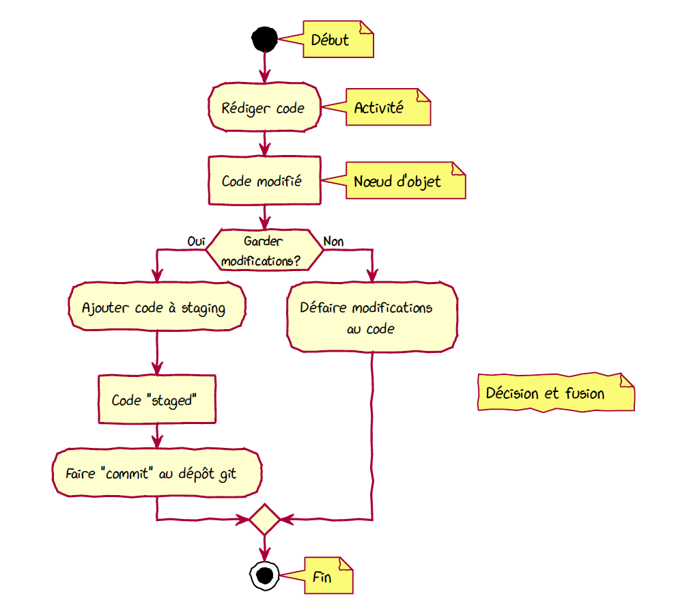
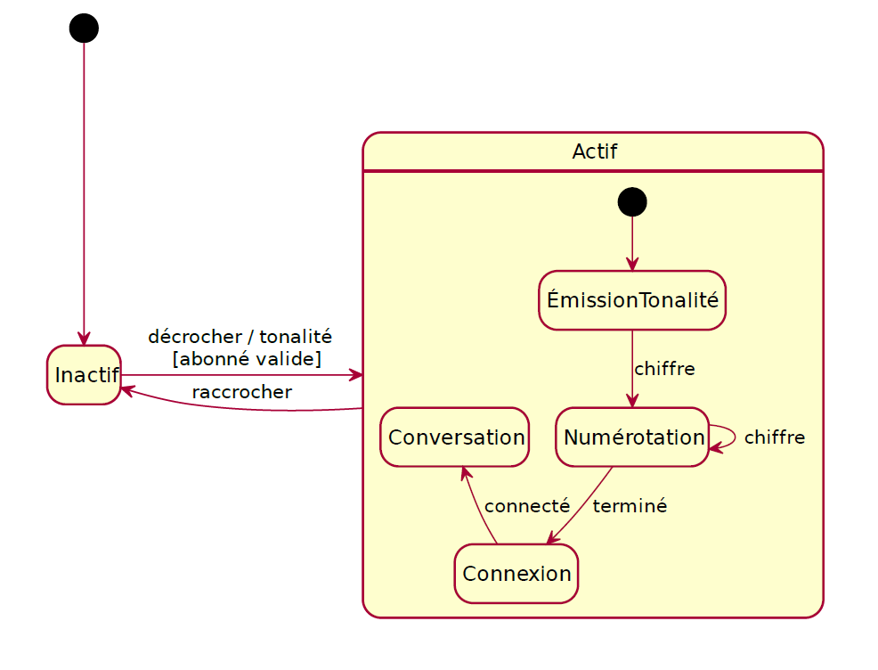
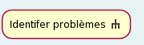
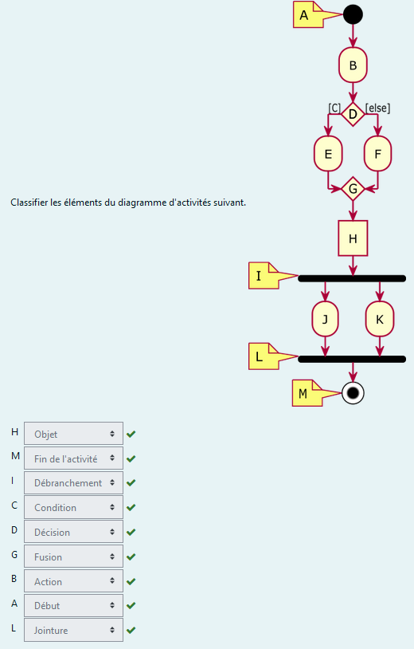
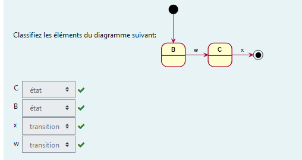

# Cours 9

# Notes de cours

## Diagrammes d'Activités A28

**Définition:** Servent a modélisre des processus d'affaires (de métier), des enchaînement d'Activités (workflows), des flots de données et des algorithmes complexes

Élements importants

- Début et fin d'activité
- Partitiion
- action
- noeud d'objet
- débranchement et jointure (parallélisme)
- décision et fusion (exlusion mutuelle)

## Diagrammes d'états A29

C'est la modélisation. Un état est une simplification de la réalité de quelque chose qui évolue dans le temps

- Un diagramme d'état sert à modéliser les comportements.
- Un diagramme d'état contient les éléments suivants :
  - Événement (occurence d'un fait significatif ou remarquable)
  - État ( la condition d'un objet à un moment donné, jusqu'a l'arrivée d'un nouvel événement)
  - Transition (relation état-événement-état | indique que l'objet change d'état)
  - Différence entre les objets
    - objet repondant de la même manière à un événement donné est un objet état-indépendant (par rapport à l'événement)
    - objet repondant différement, selon son état, à un événement donné est un objet état dépendant
  - Les transitions peuvent avoir des actions et des conditions de gard
  - Dans la notation, il y a également la possibilitèé de faire les états imbriqués

# Manuel

# Quiz

## Takeaways

- rectangle arrondi avec rateau est une sous activité
  
  
  

- Les machines a états s'appliquent de deux manières :
  - Pour la modélisation du comportement des objets tels que les équipements physiques contrôlés par des logiciel
  - Pour la modélisation des séquences d'opérations définies
- Un état est la condition d'un objet à un moment donné, il y demeure jusqu'a l'arrivée d'un nouvel événement
- Un événement est une occurence d'un fait significatif ou remarquable
- Une transition est une relation entre deux états qui indique que l'objet change d'état lorsqu'un événement se produit
