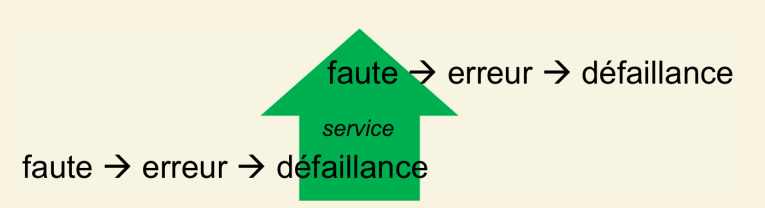

# Cours 10

## Fautes

un faute ne commet pas toujours une erreur. C'Est une source de problème.
L'erreur est la manifestation de la faute dans le système

Une faute peut provoquer une erreur, qui peut provoquer une défaillance
Vue d'un niveau plus haut, la défaillance peut être aperçue comme une faute

## Traitements des erreurs

- Exceptions
- Utiles pour des ressources telles que
  - disque dur
  - mémoire
  - réseau
  - base de donnée
  - services externes

# Notes de cours

## Fiabilité

**Termes :**

- Faute : la cause première du problème
- Erreur : La manifestation de la faute lors l'exécution. Les erreurs sont détectées (ou non)
- Échec : Déni de service causé par une erreur

D'autres points :

- Les solutions proposées par l'Architecte système et documentées par Larman impliquent les concepts suivants :
  - Mise en cache locale d'informations recherchées au service distant
  - Utilisation d'Adaptateur pour réaliser le service redondant
  - Réalisation d'un scénario de cas d'utilisation pour supporter l'échec de tout (rien ne va plus )
  - Utilisation de procuration (Proxy) de redirection pour basculer sur un service local en cas de panne

# Manuel

# Quiz
