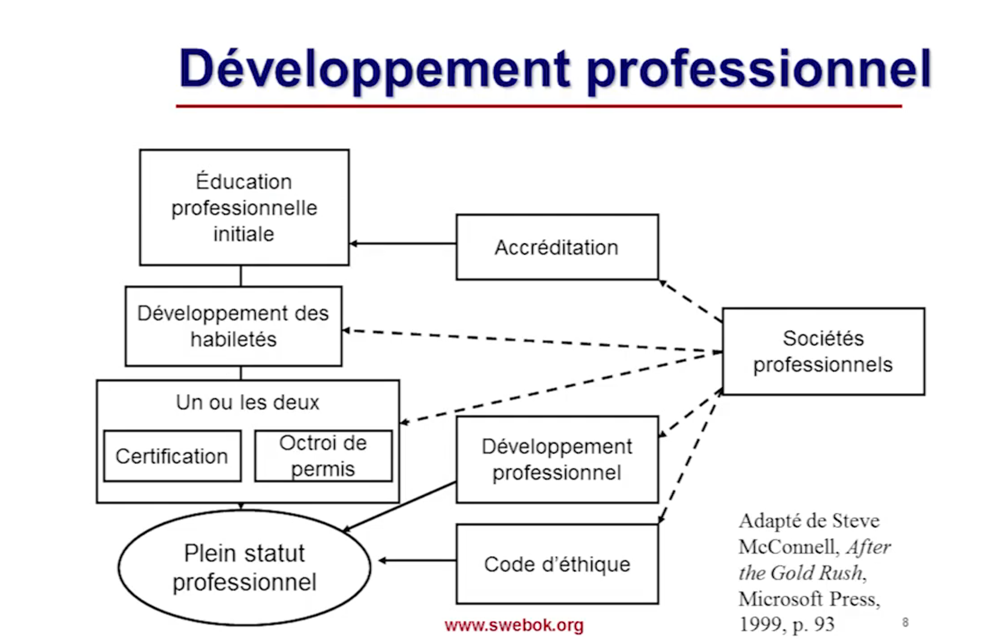
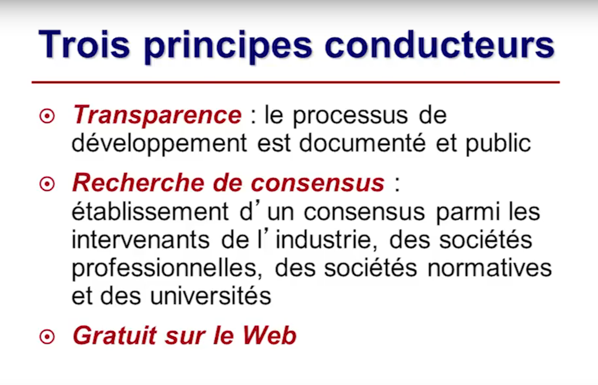
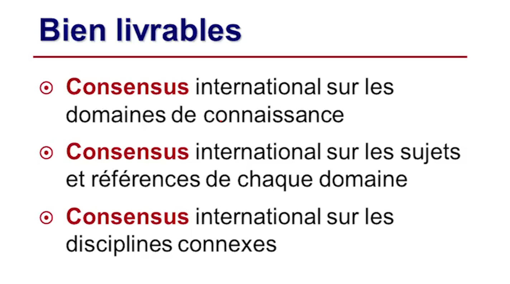
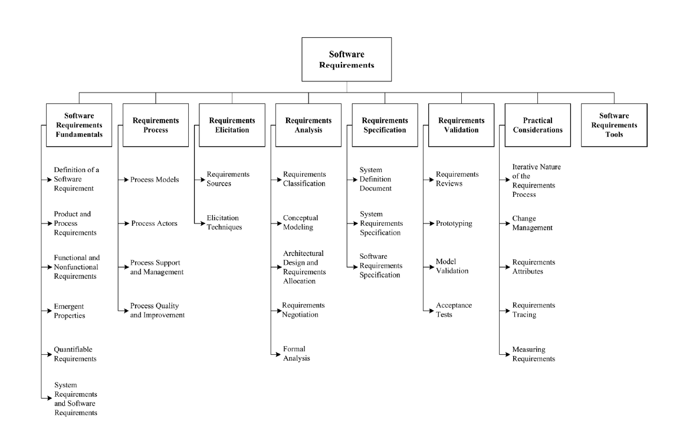

# Conférence Sweebok

**Définition:** participation internationale de membres de l'industries des sociétés professionnelles (IEEE computer science)

- Plusieurs professionnels ont commenté le document
- Rapport technique (Sweebok) vs Norme
- Une norme est prescriptive (vous devez faire ceci dans telle situation)
- Rapport technique --> document descriptif

## Software Engineering

**software enginnering utilisé pour la première fois 1968**

**Définition (selon la norme IEEE 610.12) :** Application d'une approche systématique, disciplinée, quantifiable au développement, l'exploitation et la mainteance du logiciel; c'est-à-dire l'application du génie au logiciel

ou encore : L'étude des approches telles que définies juste au dessus

approche systématique = outils techniques et normes utilisées
discipliné = les outils et les normes sont utilisées
quantifiable = nos décisions sont prises sur des mesures

#### Développement professionnel

#### Objectifs du guide

- Identifier le contenu du corpus des connaissance en génie logiciel
- Fournir un index au corpus des connaissances
- Promouvoir une vision uniforme à travers le monde
- Préciser la place et définir la frontière du génie logiciel par rapport aux autres disciplines
- Fournir la base pour le développement de programmes universitaires et du matériel de certification des individus

**L'industrie logiciel est internationalle car:**

- l'endroit de production du logiciel ne limite pas l'endroit de son utilisation (pas de frais de transports, pas de délais de transport)
- On peut avoir des centres de tests sur plusieurs fuseaux horaires (out sourcing)

### Trois principes

### Bien livrables

### Sections du sweebok

**10 sections dans le sweebok sur le logiciel:**

1. Software reqs fundamentals : definitions importantes ds le domaine du projet
1. Reqs process : processus devant etre mis en place pour explication, validation, developper des exigences logicielles
1. Requirements elicitation : comment trouver les exigences
1. Analyse des exigences : analyse des exigences (complètes cohérentes)
1. reqs specification : spécification des reqs (Vision, SRS)
1. Validation des exigences : validation ==> do the right thing | verification ==> do the thing right
1. practical consederations
1. tools for software requirements

#### Software reqs fundamentals

- Definition of a software requirement
  - a property which must be exhibited by software developed or adapted to solve a particular problem
  - Visible de l'extérieur (exhibited) (boîte noire)
    - intrants + conditions d'exécution ==> extrants
  - An essential property of all software requirements is that they be verifiable
  - **On défini notre problème dans le document de Vision**
- Product and process requirements
  - Exigences sur le produits (ce que le logiciel doit faire)
  - Exigences sur le processus du développement du logiciel (doit etre fait à l'aide de scrum | )

#### Reqs process

- Process models - S'adapte au logiciel développer (structure plus solide si logiciel nucléaire or wtv)
  - Generic models
  - not a dscrete front-end actitivity
  - requirements must be put under configuration management
  - must be tailored to context
- Process actors
  - parties prenantes
  - developpeur
  - buyers de fonds
  - clients

#### Elicitation

- Requirements sources
  - goals, domain knowledge, stakeholders, operational environment, organizational environment
- ELicitation techniques
  - interviews, scenarios, prototypes, facilitated meetings, observation

#### Analyse des exigences

- Requirements classification
  - functional, non-fuinctional, priority, scope, volatility
  - Exigences volatiles : on les traites en dernier (si non importantes)
  - on les stabilise dans d'autres circonstances
- Conceptual modeling
  - undestranding of the problem rather than initiate the design of the solution
  - UML

#### Requirements specification

- Document de vision
  - définit le logiciel
  - Document de haut niveau
- Document definition du systeme
- System requirements specification (SRS)
- Software requirements specification (SRS)

#### Reqs validation

- Reqs reviews,
- Prototyping
- Model validation
- Acceptance tests
  - tests qui sont executés par les parties prenantes
  - tests non pilotés par les développeur
  - tests boîtes noires
  - intrants --> extrants

#### Practical considerations

- Iterative nature of reqs
- Change management
  - Importance and required procedures -- Documents sont sous controle, on controle les changements de manière stricte
  - Strongly linked to CM
- Requirements attributes
  - Unique identifier
  - Strong link to requirements classification
- Requirements tracing -- tracer les exigences entre elles
- Measuring requirements -- mesure de la taille fonctionnelle

#### Outils d'exigences logicielles

- Documentation
- Tracabilité
- Gestion du changement
