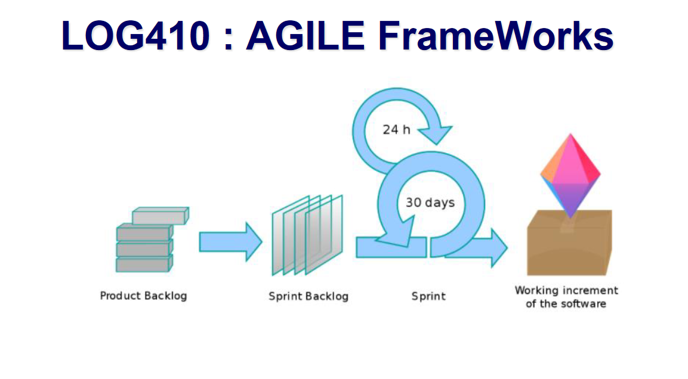
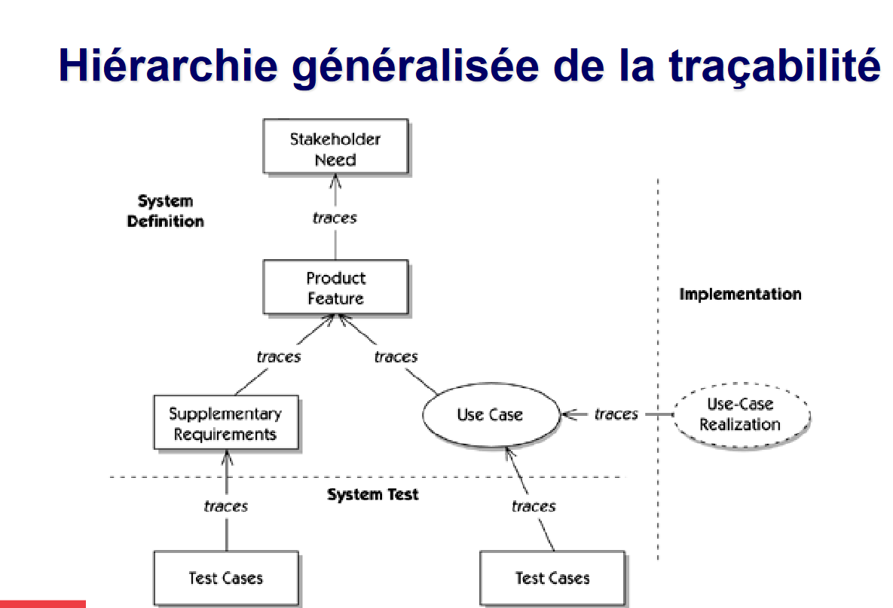

# Cours 9

Agile frameworks : solution pour gerer le changement

## Rappel use case

- acteur : peut etre une personne ou un système
- Un CU décrit les séquences d'actions qu'un système exécute
- Un CU produit un résultat observable qui a de la valeur pour un acteur particulier
  **Avantages:**
- relativement facile à écrire et à comprendre (user stories)
- Forcent les développeurs à adopter le point de vue de l'utilisateur
- Engagent les utilisateurs dans le processus de définition des exigences
- Comprend la majorité des exigences du système
- Batis selon un format stadard et commun
- Utilisés pour réaliser le **développement des cas de test**

## Tracabilité des exigences

### Short video sur un outil devTrace

**Définition:**
WIP : Work in progress

- on ne veut pas qu'il y ait des temps morts

**Fields : Time remaining et time spend**

- Deux métriques les plus importantes dans le développement logiciel

### Hiérarchie généralisé de la tracabilité

1. Définition du sytème.
   - on part des besoins des parties prenantes
1. Caractéristiques du produit (document de vision)
   - identifier qui demande quoi (joe veut la couleur rouge)
1. Requis supplémentaires
   - On trace les CU avec les caractéristiques du produits
     - on trouve qui demande les caractéristiques du produits
1. En parallèle aux requis : on a les CU réalisés/implémentés

1. **Test systèmes**
   - Cas de tests
   - liés au reqs supplémentaire/Use cases

**Comment gérer les changements :**

- Sprint
- Customers voice

## Spécifications supplémentaires

### Pourquoi :

- Plusieurs types d'exigences foncitonnelles ne peuvent pratiquement pas être exprimées dans un CU
- Certains types de système se pr^tent peu à l'usage de CU (algo de calculs, traitements non perceptibles à des utilisateurs , applications triant du text ou traduisant d'une langue à une autre)
- **Exigences non fonctionnelles**

### Catégorisations suggérée des ENF

- Convivialité ("Usability")
- Fiabilité
- Performance
- Maintenabilité

#### Convivialité

- Temps de formations pour effectuer une tache
- Temps a effectuer une tache donnée
- Perception de la communauté des utilisateurs
- Exigences concernant l'aide en ligne, l'aide contextuelle, le guide de l'utilisateur
- Suive des conventions et des normes -- > **IBM's Commun User Access**
  - toutes opérations faites avec clavier/souris
  - f5 pour reload
  - ...

##### Computer User's Bill of Rights

- user is always right.
  If problem with the use of the system, the system is the problem
- The user has te right to easy install/Uninstall
- ...

#### Fiabilité

On retrouve :

- disponbibilité
- min time between failure / min time to repaire (MTBF/MTTR)
- exactitude et précision des calculs des résultat
- nombre maximal de bogues
- bogues par catégorie (mineure, critique)
- Build farm : code test coverage

MTTF Mean time to failure -- Temps moyen avant la prochaine panne, à partir de la remise en service
MTBF Mean time between failure -- Temps moyen de détection et de résolution de la panne : comprend le temps de remise en service
MTTR Mean time to repair/restore/retrieve MTTF + MTTR

#### Performance

- Temps réponse
- Débit -- nombres de transactions / seconde
- Capacité -- nombre d'utilisateurs simultan ées
- Mode dégradé -- fonctionnement lorsque la BD est non accessible ou que le réseau est non disponible

#### Maintenabilité

- Déterminer l'effort qui sera requis afin de modifier ou de maintenir l'application une fois livré en exploitation

### Contraintes de conception

- Sources possibles des contraintes :
  - Choix technique imposé
  - Choix du processus de développement
  - Réglementation ou normes imposées

## Vidéos ENF

ENF :

- wellness of functionnality
- process and people

> Liste de catégories d'ENF

| Catégorie              | Description                                                                                     |
| ---------------------- | ----------------------------------------------------------------------------------------------- |
| Availability           | solution is operable, accessible when required for use                                          |
| Compatibility          | Degree to which the solution operates effectively with other components                         |
| Maintainnability       | Ease with which a component or solution can be modified to correct flaws/ improve performance   |
| Performance Efficiency | Load and stress to the system                                                                   |
| Portability            | Ease with which a solution / component can be transferred from one environnement to another one |
| Reliability            | For any failure condition, how reliable is the system                                           |
| Scalability            | degree to which the system is able to grow                                                      |
| Security               | Focuses on solution contents to be protected                                                    |
| Usability              | Ease with which a user can learn to use a solution                                              |
| Certification          | Focuses on convention et industry standards                                                     |
| Compliance             | regulatory financial or legal constraints                                                       |
| Localization           | Requirements dealing with local languages, law currency, spelling                               |
| SLA                    | Service Level Agreement                                                                         |
| Extensibility          | Can the solution incorporate new functionnalities                                               |

## Video à regarder - Analyse de besoins et spécifications

### traçabilité des exigences

**Definition:** capacité de pouvoir établir des liens entre les éléments nécessaire à la résolution d'un problème/besoin (caractéristiques/exigences/cas de tests/guides d'utilisations)

- devTrace outil permettant de capturer les besoins en gardant la tracabilité complète

### hiérarchie de la tracabilité

Chaînes des éléments liésensemble

- On peut partir des exigences d'affaires
- Exigences au niveau logiciel
- Requetes de changements
- Architecture
- UI
- Plan de projet

Peut prendre différentes formes

ARM : on laisse les machines creer la documentation

- la machine recherche, compte, filtre, categorise, profile, visualise.
- Analyse d'ambiguite
- Requirement management
- Modeling and simulating
- Requirement text authoring

- 50% des deffectuosités des programmes logiciels provient des exigences

- Spécifications écrites en langage naturel sont pas parfaite au début
- Tout le monde s'appui sur les specification en text
- Des inspections sont utilisées pour faire ressortire les défauts, mais
  time consuming
- Les inspections ne peuvent ne pas etre faites

Raison de la création de l'outil

- analyse lexical
- analyse synthaxique
- analyse statistique
- mesure de la constance
