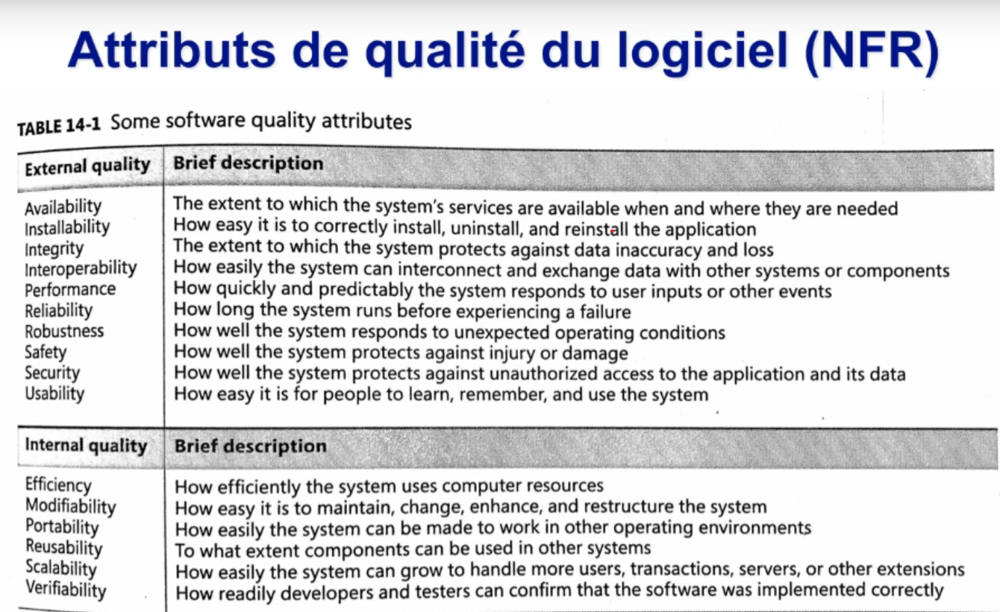

# Cours 10

## Précision sureté de fonctionnement :

- assure accidents does not occur
- consequences of an accident are minimal
  - evitement des risques | Hazard avoidance (préventif)
  - detection retrait des risques| Hazard detection (correctif)
  - limitation des dégats | damage limitation (limitatif)

#### Hazard avoidance :

system is designed so that hazards are avoided

#### Hazard detection and removal :

system is designed so that hazards are detected and removed vefore they result in an accident

#### Damage limitation :

system may include protection features that minimize the damage that may result from an accident

### Propagation de la faute

initial failure --> se fait propager par d'autres composantes du système

## Propriétés Emergentes

**Définition:** comportement du système qui apparait par le biais d'interaction ou par son évolution

depends de comment les propriétés des logicielles agissent entre elles
comment les composantes logicielles vont travaillés ensemble

**Plus on est complexe, plus on prends des risques**

## Video sur récits

- we need to learn from the stakeHolder whats really valuable to them.
- user stories capture something of value in a couple sentences
- another item of the backlog
- focus on capturing value
- we can receive feedback
- avoid creating waste
- increase value of the software we develop
- need an end to end capability -- to get feedback

### Three C's of user stories

- Card -- written on poster notes | easy to manipulate | small
- Conversation | details come from conversation with client (two ways conversation) achieves alignment with both side
- Confirmation | come to an agreement --> becomes testable criteria --> to know you are done

### Templates for user story

- Title -- flag if the user story is good (verb phrase title)
- Size -- intended to capture how big the user story is (not how long/how big)
- Story -- senbtences describing something of value to the stakeholder
- Acceptance Criterai -- Bullet list of criteria to help us to ellaborate user story, tests guideline
- Notes -- Place holders for other bits of information for the userstory (authors, sources ...)

As a **who**, i want to **what**, so that **why**.

## Récits d'utilisateurs:

- Technique de choix pour nos utilisateurs
  - comprendre ce que les utilisateurs doivent pouvoir faire avec le système
  - comprendre les attentes des utilisateurs face aux nouvelles fonctions à concevoir
  - prioriser le sfonctions du nouveau système

### Recit d'utilisateurs vs Exigences :

- les récits ne sont pas des exigences détaillés (something a system shall do)
- se sont des expressions negotiable d'intention (it needs to do something like this)
- they are short and easy to read, understandable to developpers, stakeholders and users
- represent small increments of valued functionality that can be developed in a period of days to weeks
- they are relatively easy to estimate, so effort to implement the functionality can be rapidly determined
- pas trop détaillés

# Video a regarder : Propriété émergentes

#### Attributs du qualité du logiciel

**interne ou externe au logiciel**

### Propriétés émergentes :

**Definition:** l'emergence est un concept qui intervient lorsque des systèmes simples font apparaitre, par leurs interactions ou leur evolution un autre niveau de complexité qu'il est difficile de prévoir ou de décrire par la seule analyse de ces systèmes pris isolément

- Propriétés non attendues présentes dans des systèmes complexes

Traits :

- Souvent lié à des changements de l'environnement
- Emergence peut etre benefique
- Peut creer des risques de sécurités importants
- Moins d'intégrations, moins de risques

#### Constatation :

- la complexité lié aux chanbvgements à l'environnement peuvent les créer
- Ce n'est plus une somme de comportements sunokesm naus ke r.syktat dMybe ubteractuib entre ces comportements et la complexité du système
- Parfois elles sont utiles
