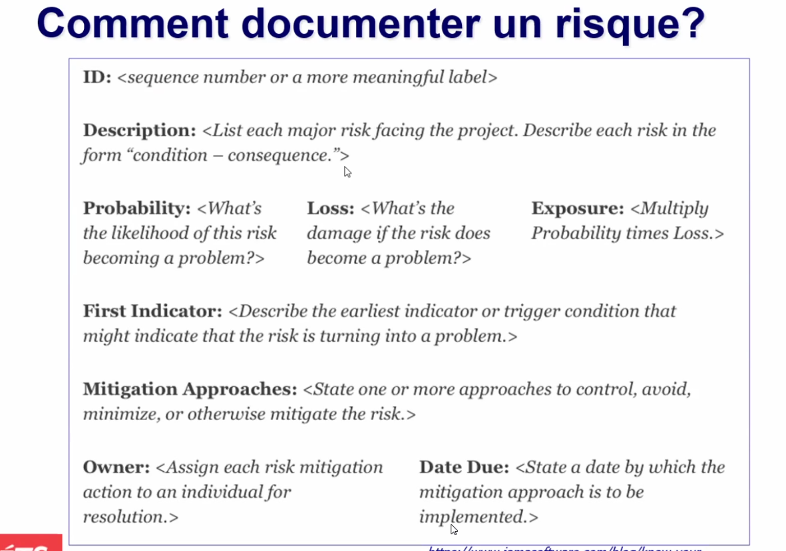
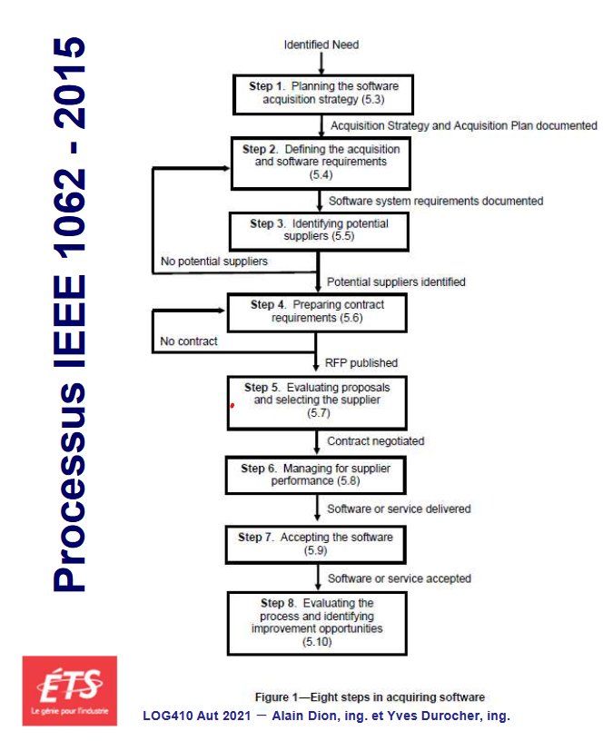

# Cours 11

### Objectifs du cours

- comprendre comment cerner le problème (document de vision)
- choisir et savoir utiliser la bonne technique d'explicitation afin de recueillir les besoins
- transposer les besoins du client en caractéristiques (document de vision)
- Rediger des exigences précises à partir des caractéristiques (SRS)
- rediger des récits d'utilisateurs
- comprendre et produire des exigences contractuelles

## Éthique en développement logiciel

Limites de ta comfortabilité dans les actions que tu pose.. Pas grand chose à rajouter

#### On parle de logiciel réussi

- Temps , cédule et coût (SPI : schedule, performance, index)
- Un projet réussi est un projet livré dans les temps précis

## Gestion des risques

**Toujours une présence de risques sur un projet.**

- Probabilité qu'un risque survienne, et quel est l'impact de son apparition.
- Deux aspects important à documenter.
- On évalue les risques en équipes : Travailler en équipe projet

**La discipline des exigences au sein du cycle de vie du logiciel n'existe que pour une seule raison : atténuer le risque que des problèmes liés aux exigences empêchent la réussite du projet**

Lorsque que l'équipe choisit une méthode pour définir les exigences, elle doit refléter les types de risques inhérents à votre enironnement

#### Comment documenter un risque

### 4 stratégies de gestion des risques (Vidéo dans le cours)

**Le plus gros risque est de penser qu'il n'y pas de risques (dénis)**

#### Gérer les risques à l 'aide de la matrice des risques

- sert a classifier les risques
- determine les risques à gerer en priorités

Pour la construire :

1. dresser un registre des risques (risk register)
   - Liste tous les risques
   - On n'agira pas sur tous les risques
   - Sert à calmer le client
   - Sécuriser le client
1. Identifier les risques
   - les classer selon leur catégorie
     - humain
     - technique (nouvelle technologie)
     - juridique (nouvelle legislation)
     - intrésèque (nouvelle implication des parties prenantes)
   - Ajouter une description en quelques mots
1. Analyser les risques
   - determiner leur impact de 1 à 4 (1 = mineur)
   - probabilité de leur occurence 1 à 4
   - Déterminer son niveau de criticité : impact \* probabilité
     - criticité peu etre classé entre : très critique >= 8 | critique 2 < x < 8| modéré <= 2
1. Determiner sur quel élément le risque peu avoir un impact
   - étendance d'évolution du risque
     - hausse
     - baisse
     - stable
1. choisir le responsable du risque s'il survient
1. Actions préventives
1. Actions correctrices
1. Prendre des décisions sur les risques à gérer
   - on regarde l'impact et la probabilité pour identifier les risques dangereux
   - zone jaune = risque modérer
   - zone orange = risque gérable
   - zone rouge = risque critique

#### Les quatres stratégies de résolution des risques

1. Éliminer le risque
   - risques proviennent souvent d'un manque d'information
   - éliminer un risque à traveurs une investigation plus approfondie
1. Transferer le risque
   - transférer les impacts négatifs du risque et les responsabilités des risques à un tiers
1. Attenuer le risque
   - mise en place d'un plan d'action pour mitiger le risque
   - porte sur la probabilité d'apparition du risque ou sur l'impact du risque
1. Accepter le risque
   - Acceptation passive
     - Laisse a l'équipe de projet le soin de faire face au risque lorsqu'il se présente
   - Acceptation active
     - Constituer une provision, les couts et délais accordés pour faire face au risque accepter constitue les contingence du projet

## Processus d'acquisition de logiciel

Normes IEEE recommended practive for software acquisition :
guide l'acteur sur l'obtention d'un logiciel

### Quelles différences existent entre la préparation des exigences pour :

- le développement d'un logiciel
  **et**
- l'acquisition d'une solution

On pars tantot d'une feuille blanche vs un code qu'on ne connait pas (boite noire)
Il peut manquer de fonctionnalités -- possibilités de les ajouters, dépends du vendeur.

### Contrats

- Convention juridique
- Lié par la loi
- Convetion par laquelle une ou plusieurs personnes s'engagent envers d'autres personnes
  - choses à faire ou ne pas faire

#### Contrats informatiques vidéos :

- Contrat de licence de logiciel
  -concession du propriétaire d'un logiciel du droit d'utilisation (license microsoft)
- Contrat de maintenance
  - spécifique
  - vise à maintenir en état de fonctionnement statisfaisant
    notre logiciel ou système informatique
- Contrat d'intégration
  - Prestation de service
  - Consiste à nous assurer une prestation permettant de rendre compatbile le logiciel à notre système d'information
  - Permet l'intégration du logiciel
- Contrat de développement de logiciel spécifique
  - logiciel vs progiciel
    - si utilisation avec grand nombre d'utilisateur est un progiciel
    - Logiciel réalisé spécifiquement pour nos besoins = logiciel
- Contrat de Cloud computing
  - SaaS : software as a service
  - IaaS : infrastructure as a service

## Devis :

**Description détaillée:**

- Des pièces
- Des matériaux
- Des opérations n écessaires
- Pour réaliser une production, une construction, une installation ou une réparation avec l'extimation des dépenses

### Terminologie - Appel D'offres

**Quelques éléments:**

- Appel d'offres, appel de propositions
  - RFP - request for proposals
    - J'ai besoin de cela
    - Faite moi une proposition de projet
      - temps
      - argent
  - Répondre à un appel d'offres nous engage, c'est un contrat
    - Si on est choisit, on est lié légalement
- Requête d'information / Demande de renseignements
  - RFI - Request for information

### Processus d'acquisition vue de très haut

- Définir le quelque chose
- Trouver / sélectionner l'autre partie
- S'entendre avec l'autre partie
- Gérer l'entente
- Terminer l'entente

### Survol de IEEE 1062 - 2015

**Guide pour acquiérir un logiciel d'une compagnie extérieur**

- Nouvelle version
- Processus en 8 étapes

1. Planifier la stratégie d'acquisition
1. Définir les requis EF/ENF
1. Identifier les fournisseur potentiel
1. Préparer le contrat des exigences
1. Évaluer les propositions des fournisseurs
1. Gérer le fournisseur
1. Accepter le logiciel
1. Evaluer le processu et identifier les possibilités d'améliorations

### Contenu de base

- Contexte
- Fonction désirées (atterrissage d'un avion, décollage d'un avion)
- Spécifications non fonctionnelles
- Contraintes
  - Environnement d'opérations
  - ETc.

### Paramètre supplémentaires

- Couts
- Conditions de livraison
- Support et maintenance
- **Termes de la licence et propriété intellectuelle**
- Formation
- Garanties
- Partage du risque
  - Qui est responsable du risque, le designer, l'utilisateur

### Developpement du devis

- Devis de base : presque équicvalent au document de vision préliminaire
- Devis détaillé : presque comme le SRS, beaucoup plus détaillé

### Vidéo enjeu de négociation

- Adéquation de la solution aux besoins du client
- Disponibilité du service et niveaux de service (Service Level Agreement ou SLAs)
- Propriété intellectuelle
- Dépendance vis-à-vis de la solution ou du prestataire
- Maîtrise du budget, des délais

# Vidéo a regarder avant

### Quest ce qu'un risque :

risque est constitué de deux composantes

- probabilité que ca survient
- impact du risque

La discipline des exigences au sain du cycle de vie du logiciel existe pour réduire **les risques des problèmes liées aux exigences**

Comment documenter un risque :

1. ID
1. Description du risque | liste des risque majeurs | sous la formes conditions et conséquences
1. Probabilité
1. Pertes engendrées
1. Exposition | Facteur de risque
1. Premier indice | First indicator que le risque survient
1. Moyens de réductions des dégats | controler | évieter | minimiser | annuler le risque
1. Responsable en cas de survenance pour la résolution
1. Date pour laquelle mitigation must be implemented

Techniques d'élicitation pour identifier les risques -- en lien avec le cours trois
par exemple, interview pour établir qui sont les stakeholders
