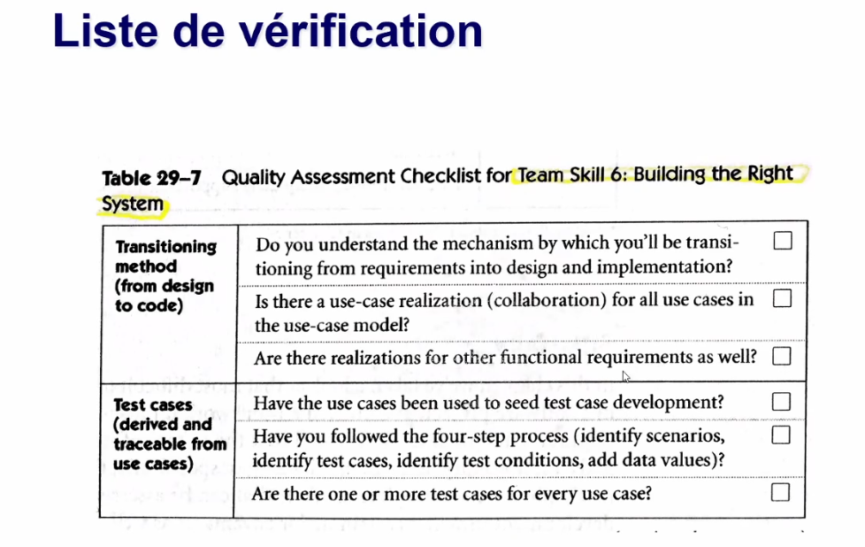
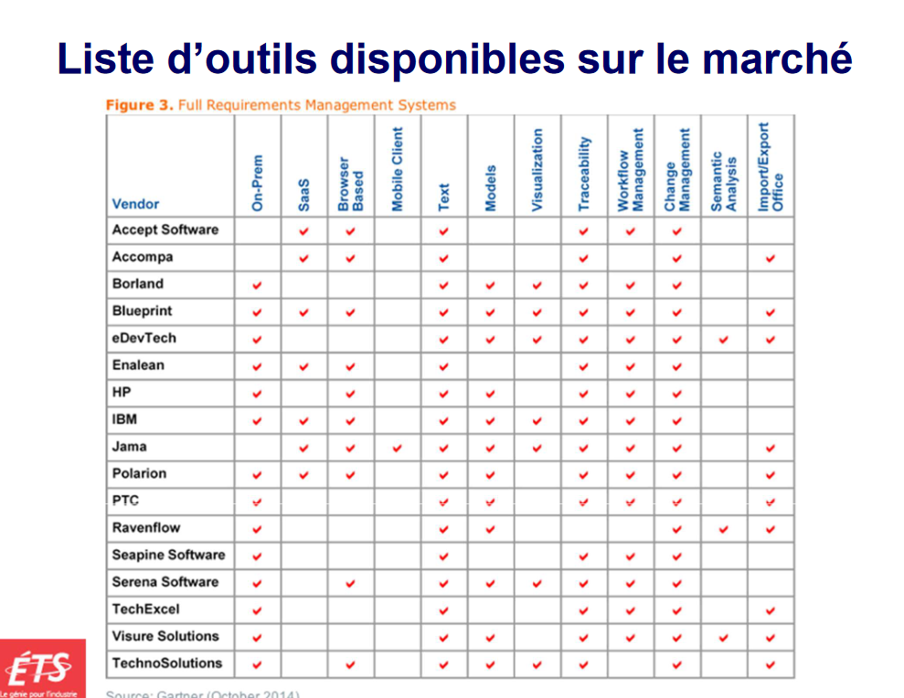

# Cours 12

## Approche Agile et exigences

### Avantage important d'une approche agile

- réactif aux changements
- tâches qu'on peut repousser
- Réévaluation des tâches et de leurs poids

### Problème de la dette technique

- Couts réel lors de la création de logiciel
- Choix du programmeur
  - dette volontaire | involontaire

#### Importance d'intégrer la dette technique

- Inclut :
  - travail à refaire
  - conception à revoir
  - éléments d'amélioration de la qualité, facilité d'entretien, l'évolution, **documentation**
- Mise en garde
  - il faut un jour repayer nos dettes
  - Comment repayer
    - prévoir 15% de l'effort de notre livraison à la dette
    - activités à prévoir dans le backlog

#### Liste de vérificaction

## Outil de gestion des exigences

- 40% à 50% des compagnies utilisent des logiciels multi-purpose (word - excel)
- They manages :
  - creation
  - iteration
  - testing
  - launch of new products

### La cible est manquée car :

- On livre une solution que le client demande mais qui ne repond pas tout le temps à leur vrai besoins (48% of the time)
- On livre des solutions qui rejoigne les besoins des clients même lorsqu'il demande autre chose (47% of the time)
- On livre des solutions qui donne au client ce qu'ils ont demandé, but often dont meet their real needs (2% of the time)
- On ne réussi pas a livrer des solutions demandées par le cl ient (1% of the time)
- Other (1% of the time)
- Don't know (1% of the time)

### Bénéfices d'utiliser un outil de gestion des exigences

- Gérer les versions et les changements
- Conserver les attributs associés aux exicgences
- Faciliter l'analyse des impacts
- Identifier les exigences manquantes ou superflues
- Gerer le suive de l'état des exigences
- Controler les accès
- **Communiquer avec les parties prenantes**

##### Quelques outils sur le marchés

### Jama software

- Outil de gestion des exigences
- Sert a la tracabilité entre toutes nos composantes
  - sont ils testé
  - comment | par qui | success?
  - breaks down documents into items
    - can send some items for review i.e.

### Contrat de licence de l'utilisateur final du logiciel (CLUF)

- protection de la compagnie selon l'utilisation du produit
