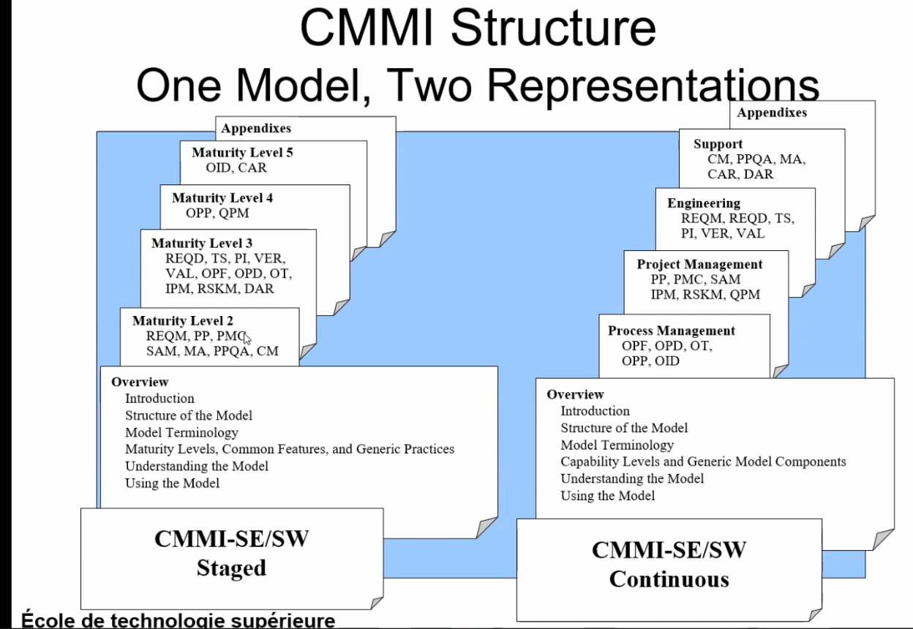
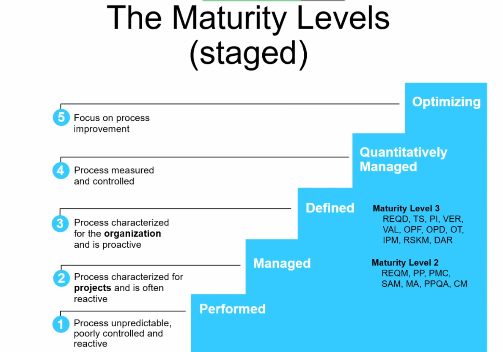
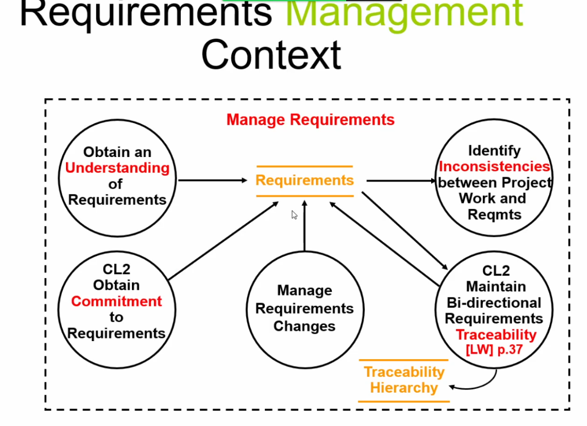

# Cours 13

## Sprint planning meetting

- start of the sprint
- objectiv : selecting a set a product backlog items which are to be delivered in the current sprint
- attended by the product owner, scrummaster, scrumteam

Focus on :

- What is to be build
- How to build it

  - task list
  - breaking the backlog into task

- meeting : 2 hours per week (for a sprint)

## Amélioration de processus et exigences logicielles

On remarque une augmentation du couplage processus| projets et exigences logicielles

- Different structures
- Causes confusion
- Hard to integrate
- Hard to use multiple models

**Leads to CMMI**

- Integrates systems and software disciplines into one process imporvement framework
- Provides a framework for introducing new discipline as needs arise
- Jonction du system/logiciel

- Systems engineering and software engineering processes are integrated
- Integrates systems and software disciplines into one process improvement framework

### Continuous representation

- Provides amximum flexibility for focusing on specific process areas **according to business goals and objectives**
- Familiar structure for those transitionning from the systems engineering community

### Stage representation

- Provides a roadmap for implementing
  - groups of precess areas
  - sequencing of implementation
- Familiar structure for those tranistioning from the SW-CMM

### CMMI structure :

### Maturity Levels

1. performed
   - ingénieur pompier (ma bad will)
   - on est réactif
1. mais processus pour les projets (reqs management)
   - encore réactif
1. on devient proactif
   - processus caractériser
1. Processus mesurer et controller
1. Amélioration des processus

### Engineering process areas | zones de processus d'ingénierie

there are six engineering process areas

1. requirements management
1. requirements development
1. technical solution
1. Product integration
1. Verification
1. Validation

#### Requirements management

- Purpose
  - Manage the requirements of the projects prpoduct and procduct components and identify inconsistencies between :
    - those requirements
    - the project's plan and works products

## CMMI process areas categories

- Process management
- Project management
- Engineering
- Support

## Maturity level 2 - Managed

- Reqs are managed processes are planned, performed, measured, and controlled
- Existing practices are retained during times of stress. Projects are performed and managed according to thier documented plans
- Reqs, processus, work products, and services are managed. The status of the work products and the delivery of services are visible to management at defined points
- Commitments are established among relevant strakeholders and are revised as needed. Work products are reviewed with stakeholders and are controlled

### REQM - requirements management

- SG 1 Manage requirements
  - Requirements are managed and inconsistencies with project plans and work products are identified

### Process categories

- Process management processess
  - defining, planning, resourcing, deploying, implementing, monitoring, controlling, appraising, measuring and imporving processes
- Project management processes
  - planning, monitoring and controlling the project
- Engineering processes
  - Development and maintenance practices
  - Product development process rather than discipline-specific processes
- Support processes
  - Support of product development and maintenance. They address processes that are used in the context of performing other processes
